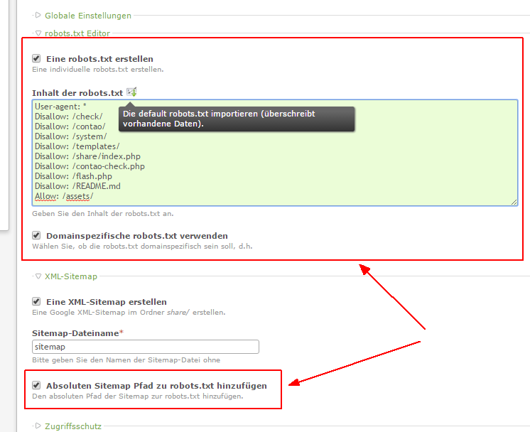

# Contao Extension: hofff.com - robots.txt Editor

Provides an editor for auto creation and modification of robots.txt inside a Contao root page.

## Features

- Define content of robots.txt in root page
- Add absolute path to sitemap
- If the extension [hofff/contao-htaccess](https://packagist.org/packages/hofff/contao-htaccess) is installed it is possible to create different custom robots.txt files in a multi site installation.

## Compatibility

- Contao version >= 3.2.0 ... <  3.6.0
- Contao version >= 4.4.0

## Installation

Install the extension via composer: [hofff/contao-robots-txt-editor](https://packagist.org/packages/hofff/contao-robots-txt-editor).

If you prefer to install it manually, download the latest release here: https://github.com/hofff/contao-robots-txt-editor/releases

## Dependency

There are no dependencies to other extensions, that have to be installed.

The extension [hofff/contao-htaccess](https://packagist.org/packages/hofff/contao-htaccess) is suggested to use different custom robots.txt files in a multi site installation.

## Screenshots

